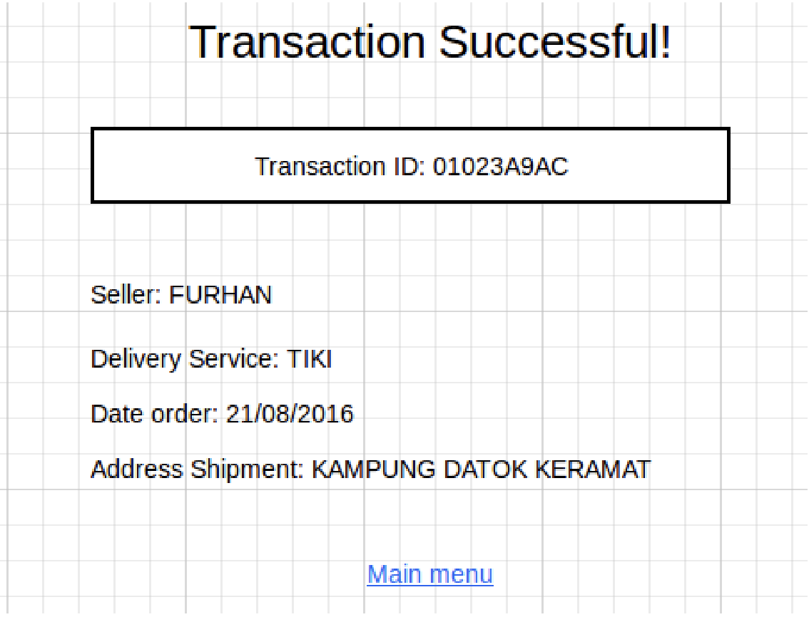
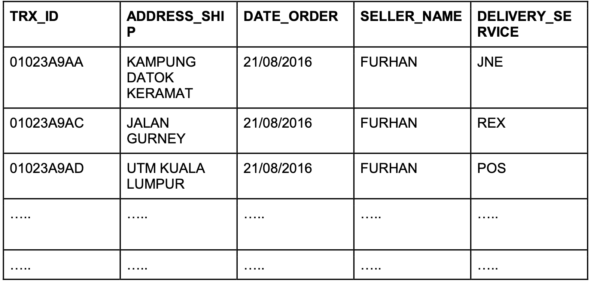

# Soal test maggang Quality Assurance engineer

Berikut adalah soal/pertanyaan yang perlu dijawab oleh peserta

## knowledge base

1. Apa yang anda ketahui tentang Rest API?
2. Apa yang anda ketahui tentang Server side and Client side processing?
3. Apa yang anda ketahui tentang Monolith dan Microservices, berikan contohnya?
4. Apa yang anda ketahui tentang Automation testing serta sebutkan contohnya?
5. Dengan menggunakan tools automation testing tersebut, biasanya menggunakan bahasa/tools apa?

## Use cases

Suppose there was a transaction that had been done in tokopedia.com , the transaction
id should be available on the screen alongside with the address of shipment, date of
order, seller’s name, and delivery service (JNE/POS/REX/others). 
The transaction id (TRX_ID) should also be available on the database which again supposedly there was a simple table containing all the transaction data.

Apparently, the order `01023A9AC` seems to have different Delivery Service on the UI and the
database record. How do you, as automation test developers develop such test scenario so that
this kind of error does not occur?